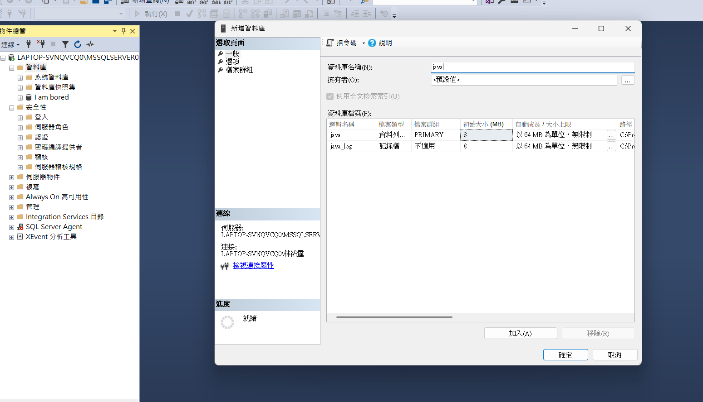
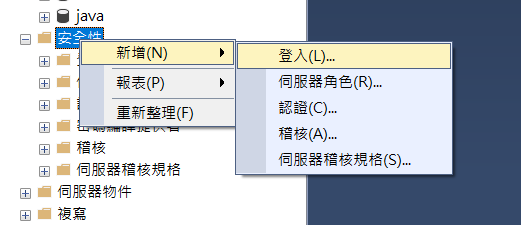
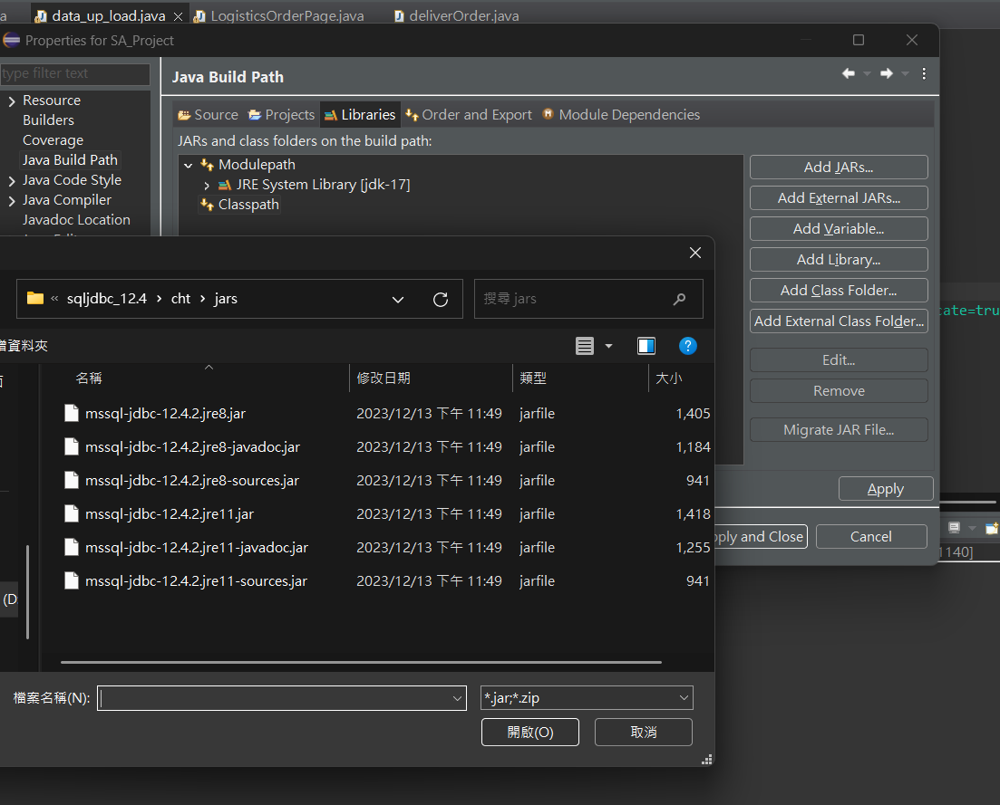
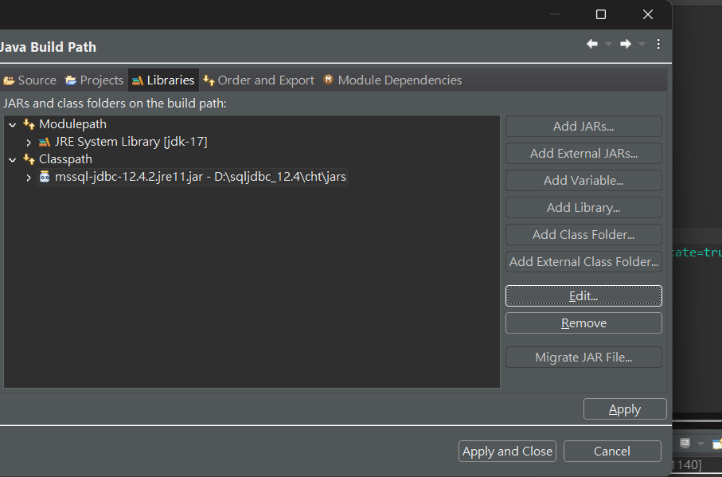

# SA_物流揀貨系統安裝說明書
### 安裝Eclipse(請看image-安裝Eclipse)

請安裝[Eclipse IDE for Java Developers](https://www.eclipse.org/downloads/download.php?file=/technology/epp/downloads/release/2024-12/R/eclipse-java-2024-12-R-win32-x86_64.zip)

另外，如果你電腦還未設定好JDK，那可以參考筆者之前寫的[Java JDK](https://www.kjnotes.com/devtools/35) 建議安裝JDK17。
安裝與環境變數設定教學。
### 下載SSMS(資料庫)

[下載 SSMS](https://learn.microsoft.com/en-us/sql/ssms/download-sql-server-management-studio-ssms?view=sql-server-ver16)點擊「Download SQL Server Management Studio (SSMS)」。
## 設定SSMS(請看image-ssms)

進入SSMS後建立資料庫
1. 請先新增資料庫(名稱請設定為"java")，右鍵點擊資料庫，選擇新增資料庫。

2. 新增使用者

3. 設定使用者權限(名稱請設定為"project"，密碼為12345678，第一次系統會要求更改密碼，請改成123456789)
.png)

4. 設定使用者可以編寫資料庫
.png)
## 輸入程式碼

## 在Eclipse設定JDK

在正式啟動系統前，請先安裝好JDK驅動程式(請看image-設定JDK)
1. 右鍵點開輸入的project，點選build path->configure build path
2. 點選Libries，設定ModuelPath(點選Add Libraries)
設定.png)
.png)
3. 接著設定ClassPath(點選Add External，這邊選擇的是jre11.jar)

4. 完成設定的樣子，接著點選apply and close就可以了

## 執行程式碼
